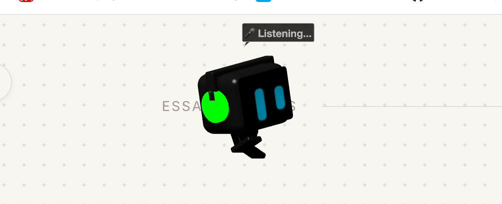
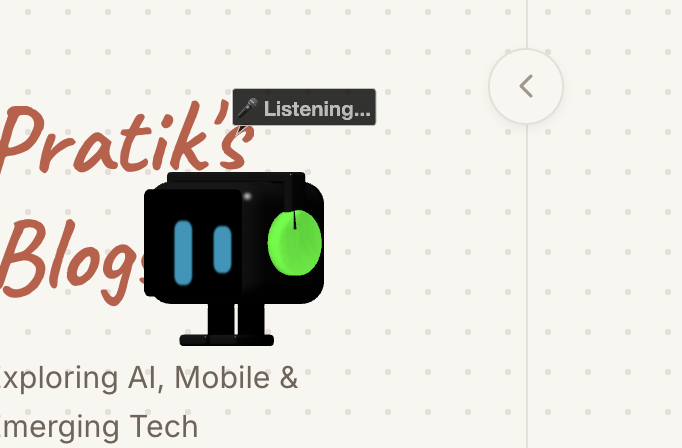
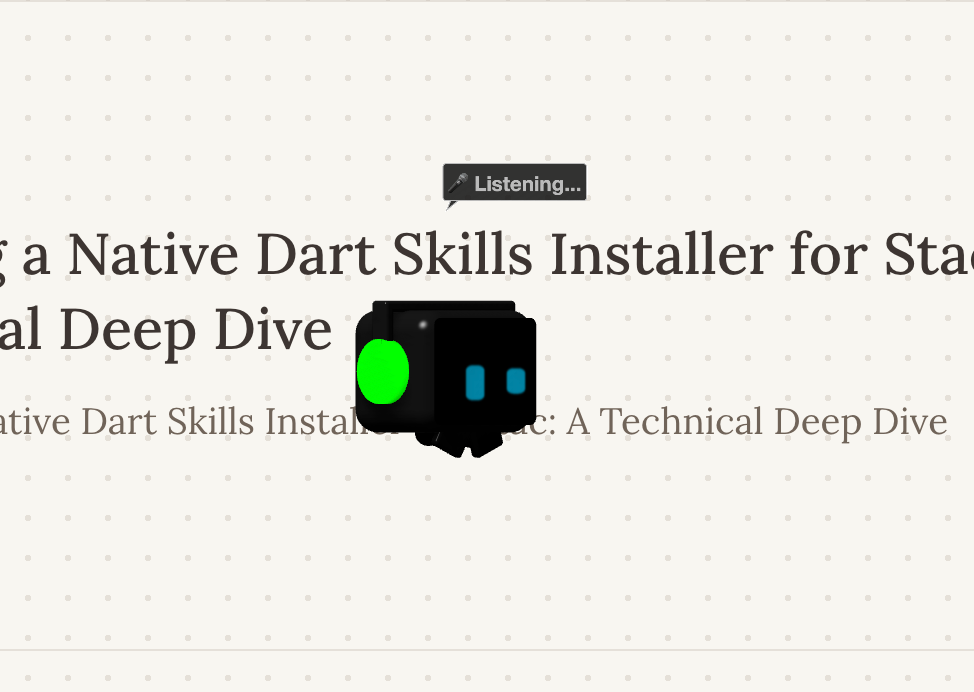
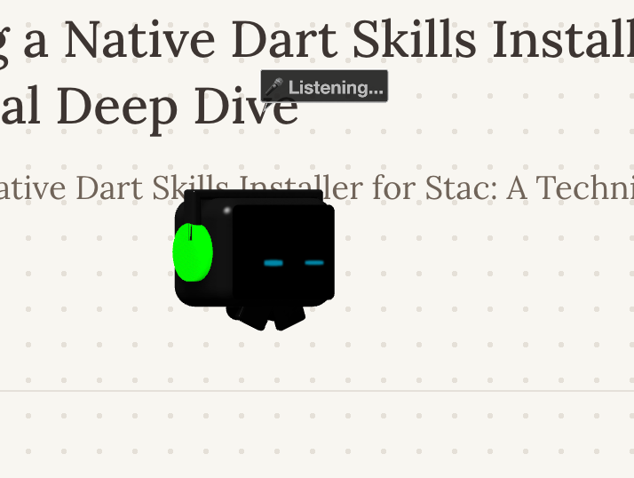

<div align="center">
  
  
  <h1>Byte: Intelligent 3D Desktop Pet for macOS</h1>
  <p>
    <b>An open-source, context-aware 3D desktop companion built natively for macOS.</b>
  </p>
  
  <p>
    <a href="https://github.com/pratikdate/Byte/stargazers"></a>
    <a href="https://github.com/pratikdate/Byte/network/members"></a>
    <a href="https://github.com/pratikdate/Byte/issues"></a>
    <a href="https://github.com/pratikdate/Byte/blob/main/LICENSE"></a>
  </p>
</div>

<br/>

<p align="center">
  
  
  
  
  
</p>

## 📖 Overview

**Byte** is a natively built macOS overlay using Swift and SceneKit. Operating right on your desktop, Byte interacts with your workspace, responds to system events, and exhibits dynamic AI-driven behaviors based on environmental context. 

Unlike traditional static widgets, Byte brings life to your desktop with completely on-device AI integration.

---

## ✨ Key Features

### 🎮 3D Rendering & Physics Engine
* **SceneKit Integration:** Fully rendered 3D models with programmatic animations and physics-based interactions.
* **Custom Physics Simulation:** Features custom gravity, velocity, and friction models applied outside of standard SceneKit physics bodies, allowing Byte to interact with macOS UI elements (such as treating the Dock as a physical floor).
* **Interactive Manipulation:** 
  * Free-form drag and drop with calculated trajectory/throw physics.
  * Trackpad and scroll-wheel support for persistent 3D rotation (`manualRotationY`).

### 🧠 Context-Aware AI & State Machine
* **`PetBrain` State Machine:** Governs behavioral states (Idle, Wander, Sleep, Sulk, Dizzy) with a sophisticated priority queue and emotion mapping (`annoyance`, `energy`, `happiness`).
* **Workspace Awareness:** Utilizes macOS Accessibility APIs (`AXUIElement`) to track active applications, window positions, and bounds. Byte dynamically interacts with your active windows.
* **Audio & Media Detection:** Integrates with `CoreAudio` to detect physical output routes (e.g., connected headphones) and active media playback (Spotify, Apple Music).
* **Real-Time Weather Integration:** Subscribes to local weather APIs to adapt Byte's behavior to the physical world.

### 🎙️ 100% Local AI Intelligence
Byte's processing power has been upgraded to run **entirely on-device**, ensuring zero data leaves your Mac:
* **Speech Recognition:** Powered by `faster-whisper` for fast, offline transcription.
* **Dialogue Generation:** Runs on **Gemma 2B** via Ollama, utilizing emotion-aware prompts.
* **Natural Voice TTS:** Uses Kokoro (or a system fallback) for emotionally expressive, pause-aware text-to-speech.

---

## 🏗 Architecture

The project is cleanly structured into distinct managers and engines:

* **`PetScene.swift`**: The core SceneKit rendering and physics loop. Handles the `tick` event for custom gravity, velocity calculations, procedural animations, and mouse event tracking.
* **`PetBrain.swift`**: The state machine. Evaluates conditions (energy depletion, annoyance levels) and dictates the active `PetState`.
* **`AIEngine.swift`**: The analytical layer. Synthesizes data from the environment and interacts with local LLMs (Ollama) to drive events.
* **`DesktopEnvironmentManager.swift`**: Parses the macOS Accessibility UI tree.
* **`AudioMonitor.swift` / `WeatherManager.swift`**: Dedicated hardware/network observers.

---

## 🚀 Getting Started

### Prerequisites
* **OS:** macOS 14.0 (Sonoma) or later
* **IDE:** Xcode 15.0 or later
* **Language:** Swift 5.0+

### Installation & Build

1. **Clone the repository:**
   ```bash
   git clone https://github.com/pratikdate/Byte.git
   cd Byte
   ```

2. **Open the project in Xcode:**
   ```bash
   open DesktopPet.xcodeproj
   ```

3. **Build and Run:**
   Select your local Mac as the build destination and hit `Cmd + R`.

4. **Permissions:** 
   On first launch, macOS will prompt for **Accessibility Permissions**. This is required to read window frames and dock positions. 
   * Go to `System Settings > Privacy & Security > Accessibility` and toggle the switch for `DesktopPet`.

> [!TIP]
> **Want local AI speech features?**
> Check out the [Quickstart Guide](QUICKSTART.md) for setting up Ollama (Gemma 2B) and Whisper!

---

## 🌐 Documentation & Web Sandbox

In addition to the native macOS application, Byte includes a fully interactive documentation website built with React and Docusaurus (`website/`).

* **Web-Based 3D Engine:** The Docusaurus homepage features a 1:1 React & Three.js port of the SceneKit Byte model. It runs entirely in the browser!
* **Kokoro TTS Sandbox:** Test Byte's voice synthesis capabilities locally via the dedicated sandbox (`Kokoro/kokoro.js`).
* **Retro-Tech Aesthetic:** The documentation site uses the `VT323` pixel font for a pristine digital look.

---

## 🤝 Contributing

Contributions to Byte are highly encouraged! Whether it's adding new state behaviors, expanding context awareness, or optimizing the physics engine:

1. Fork the project.
2. Create your feature branch (`git checkout -b feature/AmazingFeature`).
3. Commit your changes (`git commit -m 'Add some AmazingFeature'`).
4. Push to the branch (`git push origin feature/AmazingFeature`).
5. Open a Pull Request.

---

## 📝 License

Distributed under the MIT License. See `LICENSE` for more information.

<div align="center">
  <p>Made with ❤️ for macOS by the Byte community.</p>
</div>
