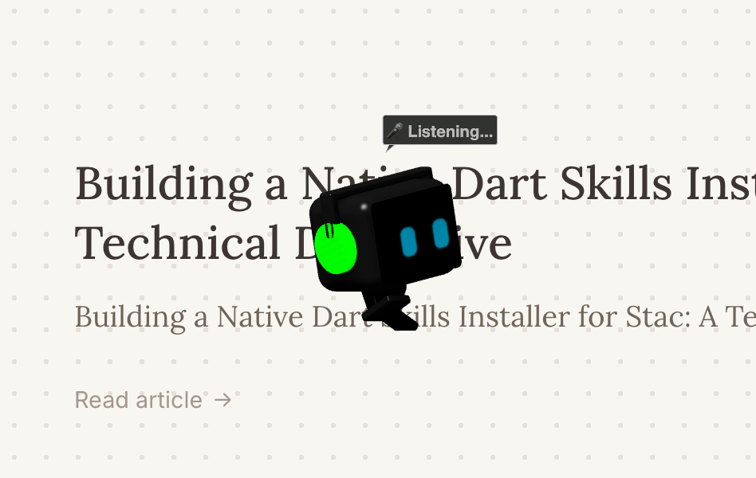

# Byte: Intelligent 3D Desktop Pet for macOS

<div align="center">
  
</div>

<br/>

<p align="center">
  
  
  
  
</p>

**Byte** is an open-source, context-aware 3D desktop companion built natively for macOS using Swift and SceneKit. Operating as an overlay on the macOS desktop, Byte interacts with your workspace, responds to system events, and exhibits dynamic AI-driven behaviors based on environmental context.

## 🌟 Key Features

### 3D Rendering & Physics Engine
- **SceneKit Integration**: Fully rendered 3D models with programmatic animations and physics-based interactions.
- **Custom Physics Simulation**: Features custom gravity, velocity, and friction models applied outside of standard SceneKit physics bodies, allowing Byte to interact with macOS UI elements (such as treating the Dock as a physical floor).
- **Interactive Manipulation**: 
  - Free-form drag and drop with calculated trajectory/throw physics.
  - Trackpad and scroll-wheel support for persistent 3D rotation (`manualRotationY`).

### Context-Aware AI & State Machine
- **`PetBrain` State Machine**: Governs behavioral states (Idle, Wander, Sleep, Sulk, Dizzy) with a sophisticated priority queue and emotion mapping (`annoyance`, `energy`, `happiness`).
- **Workspace Awareness (`DesktopEnvironmentManager`)**: Utilizes macOS Accessibility APIs (`AXUIElement`) to track active applications, window positions, and bounds. Byte can dynamically interact with your active windows.
- **Audio & Media Detection (`AudioMonitor`)**: Integrates with `CoreAudio` to detect physical output routes (e.g., connected headphones) and active media playback (Spotify, Apple Music), triggering contextual animations like wearing DJ headphones.
- **Real-Time Weather Integration (`WeatherManager`)**: Subscribes to local weather APIs to adapt Byte's behavior to the physical world (e.g., deploying a programmatic 3D umbrella during rain).

## 🏗 Architecture

The project is structured into distinct managers and engines to ensure a clean separation of concerns:

- **`PetScene.swift`**: The core SceneKit rendering and physics loop. Handles the `tick` event for custom gravity, velocity calculations, procedural animations, and mouse event tracking.
- **`PetBrain.swift`**: The state machine. Evaluates conditions (energy depletion, annoyance levels) and dictates the active `PetState` protocol implementation.
- **`AIEngine.swift`**: The analytical layer. Synthesizes data from the environment (weather, time, active apps) and generates prompts/decisions to drive spontaneous events.
- **`DesktopEnvironmentManager.swift`**: Handles low-level macOS Accessibility integrations to parse the UI tree.
- **`AudioMonitor.swift` / `WeatherManager.swift`**: Dedicated hardware/network observers.

## 🚀 Getting Started

### Prerequisites
- **OS**: macOS 14.0 (Sonoma) or later
- **IDE**: Xcode 15.0 or later
- **Language**: Swift 5.0+

### Installation & Build

1. Clone the repository:
   ```bash
   git clone https://github.com/yourusername/DesktopPet.git
   cd DesktopPet
   ```
2. Open the project in Xcode:
   ```bash
   open DesktopPet.xcodeproj
   ```
3. Select your local Mac as the build destination and hit `Cmd + R` (Run).
4. **Permissions**: On first launch, macOS will prompt for **Accessibility Permissions**. This is required for `DesktopEnvironmentManager` to read window frames and dock positions. 
   - Go to `System Settings` > `Privacy & Security` > `Accessibility` and toggle the switch for `DesktopPet`.

## 🛠 Contributing

Contributions to Byte are highly encouraged! Whether it's adding new state behaviors, expanding context awareness, or optimizing the physics engine:

1. Fork the project.
2. Create your feature branch (`git checkout -b feature/AmazingFeature`).
3. Commit your changes (`git commit -m 'Add some AmazingFeature'`).
4. Push to the branch (`git push origin feature/AmazingFeature`).
5. Open a Pull Request.

## 📝 License

Distributed under the MIT License. See `LICENSE` for more information.
