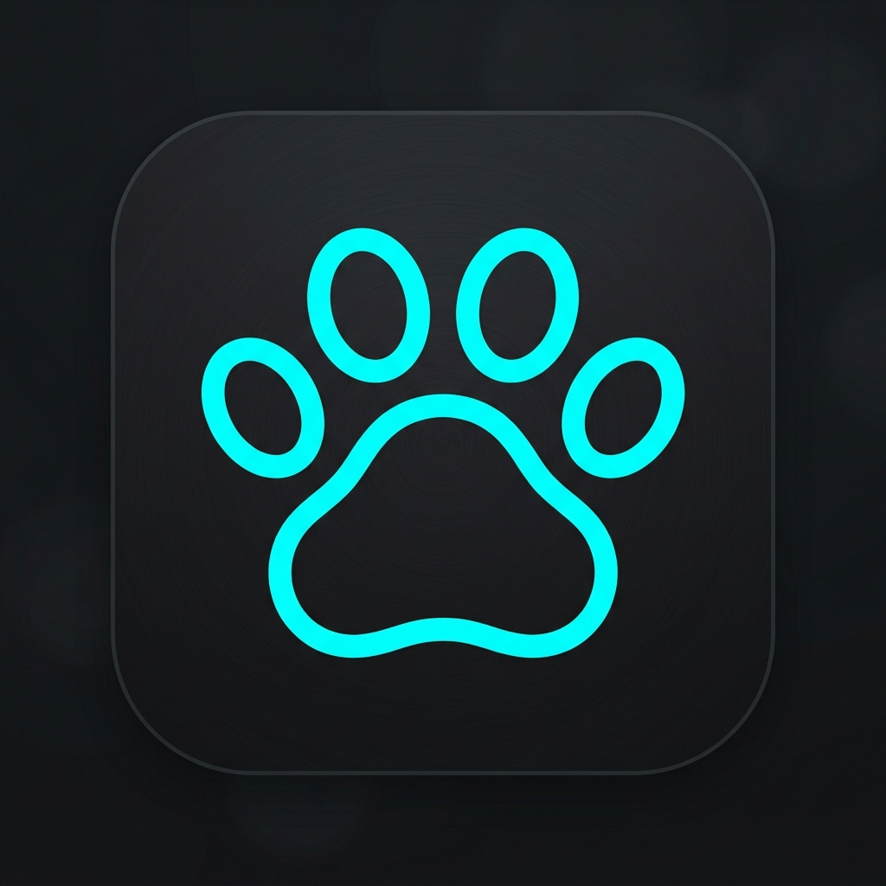
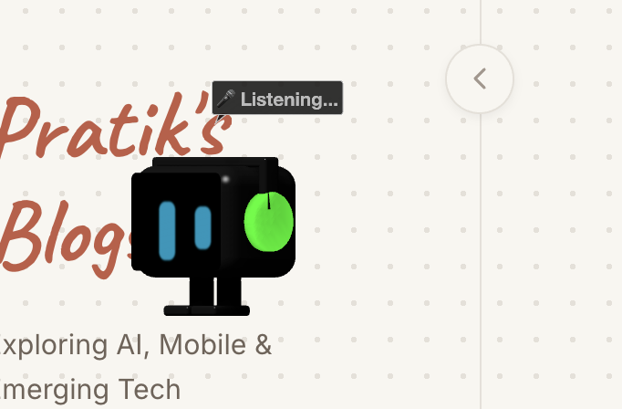
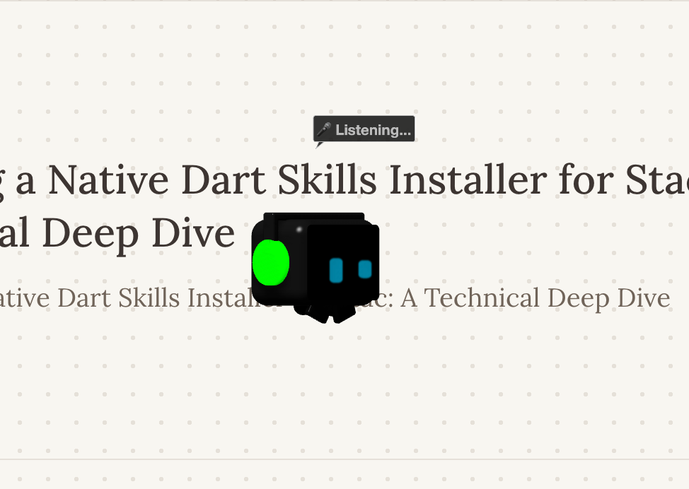
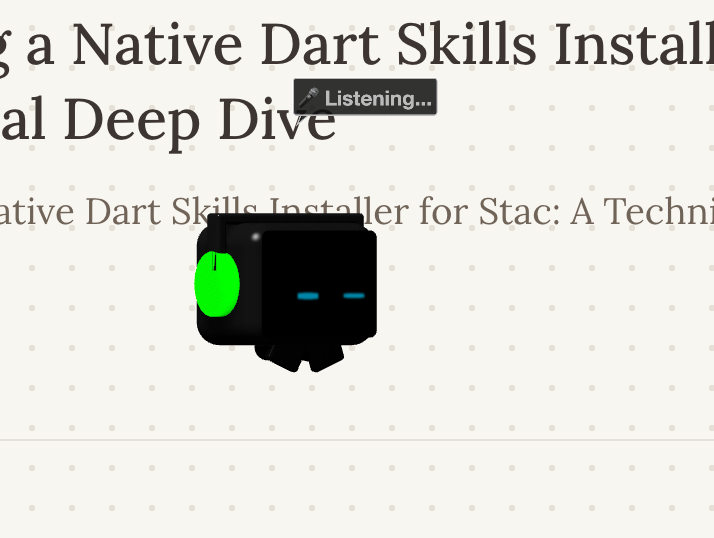
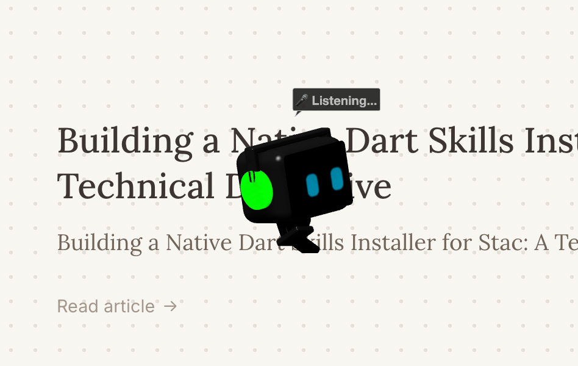
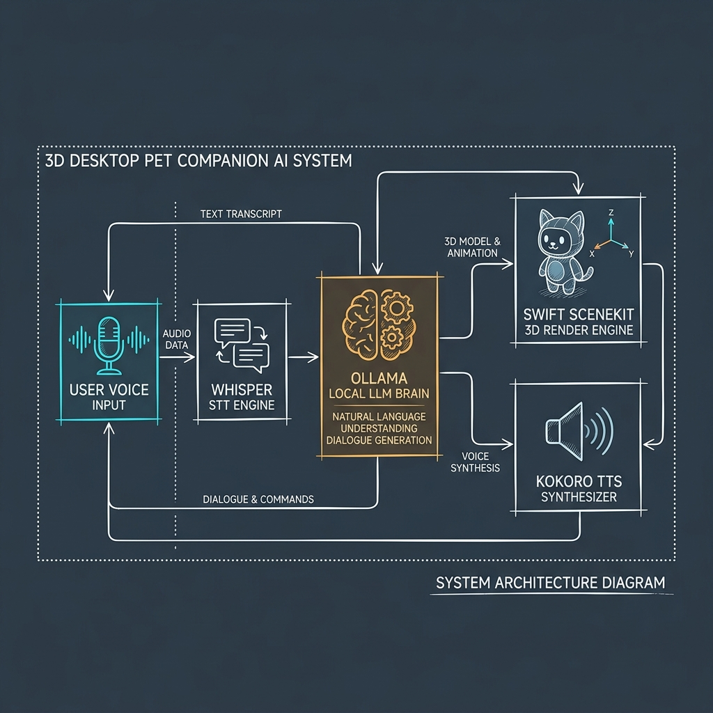
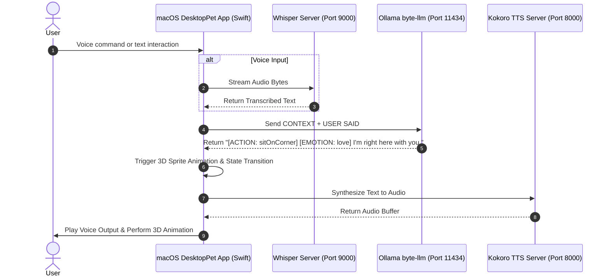
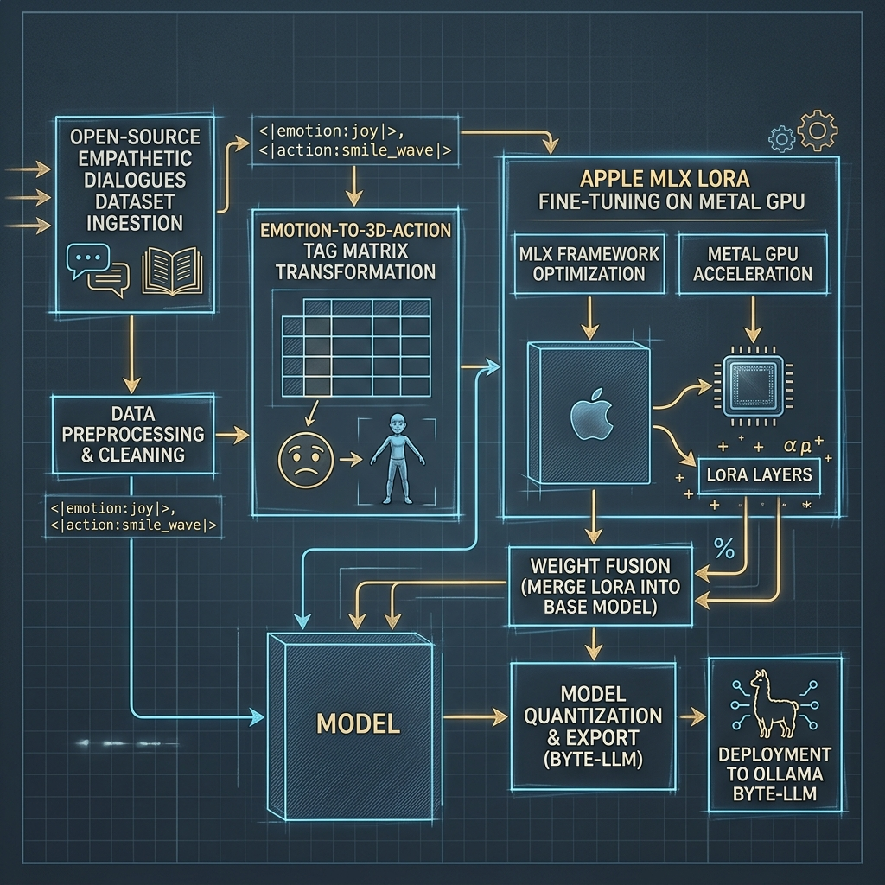

# 🐾 Byte: Intelligent 3D Desktop Pet Companion for macOS

<div align="center">
  
  
  ### *Empathetic, Autonomous, and Offline AI Desktop Companion*

  [](https://developer.apple.com/macos/)
  [](https://swift.org)
  [](https://github.com/ml-explore/mlx)
  [](https://ollama.ai)
  [](LICENSE)
</div>

<br/>

<p align="center">
  
  
  
  
</p>

---

## 📖 Overview

**Byte** is an open-source, context-aware 3D desktop pet companion built natively for macOS using **Swift** and **SceneKit**. Operating as a transparent, interactive overlay above the macOS desktop, Byte interacts with your active windows, responds to physical gestures, listens to your voice offline, and exhibits dynamic emotional behaviors fine-tuned using local machine learning.

Unlike static desktop widgets, Byte runs a **hybrid machine learning architecture**:
- **Q-Learning Action Brain (`ReinforcementLearningModel`):** Autonomous wandering, sleeping, perching, and idle state selections calculated via Bellman equation state-reward policies.
- **Local Empathy LLM (`byte-llm`):** Fine-tuned on **45,000+ open-source empathetic dialogue pairs** (Meta AI's EmpatheticDialogues) using Apple Silicon MLX GPU acceleration.
- **On-Device Voice Subsystem:** Offline speech recognition via **Whisper STT** and hyper-realistic speech synthesis via **Kokoro TTS**.

---

## 🌟 Key Features

### 🧠 1. Empathy AI & Context Deduction
- **Open-Source Fine-Tuning:** Trained on 45,328 conversation pairs using Apple MLX Metal GPU LoRA fine-tuning.
- **Dual Tag Output:** Generates structured action-emotion predictions (`[ACTION: sitOnCorner] [EMOTION: cozy]`) to seamlessly animate the 3D pet sprite alongside text dialogue.
- **Workplace Pacing:** Detects deep coding sessions, long IDE typing, compiler errors, or evening hours to gently suggest hydration, stretch breaks, or posture checks.

### 🗣️ 2. 100% Offline Voice & Dialogue Loop
- **Speech-to-Text (STT):** Local low-latency audio transcription using `faster-whisper` (Port 9000).
- **Text-to-Speech (TTS):** Natural speech output powered by Kokoro TTS (Port 8000).
- **Privacy First:** Zero cloud API dependencies; your voice audio and workspace state never leave your Mac.

### 🎮 3. 3D SceneKit Render & Physics Engine
- **Custom Surface & Window Gravity:** Byte walks along window frames, perches on the menu bar, and walks across the macOS Dock floor.
- **Interactive Drag & Throw Physics:** Click and toss Byte across your desktop with velocity, drag, friction, and bounce trajectory calculations.
- **Camera Orbiting & Touch Controls:** Rotate Byte 360° on the Y-axis using mouse trackpad scrolling or drag interactions.

### 💻 4. macOS Workspace Awareness
- **Accessibility API Integration (`AXUIElement`):** Reads active application names and window frame coordinates.
- **Media & Headphone Detection:** Subscribes to `CoreAudio` to detect output device changes and media playback (Apple Music, Spotify).
- **Real-Time Environment Adaptability:** Synchronizes behavior with local weather and time of day (e.g. cozy night rest mode, rainy day umbrella state).

---

## 📐 System Architecture




```mermaid
sequenceDiagram
    autonumber
    actor User
    participant App as macOS DesktopPet App (Swift)
    participant STT as Whisper Server (Port 9000)
    participant LLM as Ollama byte-llm (Port 11434)
    participant TTS as Kokoro TTS Server (Port 8000)

    User->>App: Voice command or text interaction
    alt Voice Input
        App->>STT: Stream Audio Bytes
        STT-->>App: Return Transcribed Text
    end
    App->>LLM: Send CONTEXT + USER SAID
    LLM-->>App: Return "[ACTION: sitOnCorner] [EMOTION: love] I'm right here with you."
    App->>App: Trigger 3D Sprite Animation & State Transition
    App->>TTS: Synthesize Text to Audio
    TTS-->>App: Return Audio Buffer
    App->>User: Play Voice Output & Perform 3D Animation
```

For full technical specifications, read our **[Empathy AI & ML Architecture Guide](docs/EMPATHY_TRAINING_AND_ML_ARCHITECTURE.md)**.

---

## 🔬 Machine Learning & Empathy Training Pipeline



### Training Highlights:
- **Dataset Size:** 45,328 total items (`train.jsonl`: 38,528 | `valid.jsonl`: 6,800).
- **Hardware Acceleration:** Apple Silicon Metal GPU via `mlx-lm`.
- **Validation Loss Improvement:** Drop from `4.487` ➔ `2.151` (>50% optimization).
- **Quantized Deployment:** Exported to `./training/byte_fused_model` and served through Ollama `byte-llm`.

### 🔄 How We Continuously Improve Byte:
1. **Offline Self-Reflection Engine (`ReflectionEngine`):** Background reflection pass during sleep mode analyzes user interactions and updates permanent rules in `memory_graph.json`.
2. **On-Device Q-Learning Reinforcement (`ReinforcementLearningModel`):** Physical movement and state transitions continuously update a local Q-table via Bellman reward signals.
3. **Incremental LoRA Checkpoints:** User interaction feedback is periodically merged back into `train.jsonl` to re-tune model weights incrementally.

For a deep mathematical break-down, read our **[Empathy AI Architecture & Continuous Learning Guide](docs/EMPATHY_TRAINING_AND_ML_ARCHITECTURE.md)**.

---

## ⚡ Quickstart & Installation

### Prerequisites
- macOS 14.0 (Sonoma) or newer on Apple Silicon (M1/M2/M3/M4) or Intel Mac.
- Xcode 15+ installed.
- Python 3.9+ installed.
- [Ollama](https://ollama.ai) installed.

### 1. Clone Repository
```bash
git clone https://github.com/your-username/Byte.git
cd Byte
```

### 2. Launch Entire System (One Command)
Run the launcher script to automatically start Ollama, Whisper STT, Kokoro TTS, and launch `DesktopPet.app`:
```bash
chmod +x start.sh
./start.sh
```

---

## 🛠 Model Training & Reproduction

### Re-build Master Dataset from Open-Source EmpatheticDialogues:
```bash
python3 training/download_and_build_master_dataset.py
```

### Run LoRA Fine-Tuning on Apple Silicon Metal GPU:
```bash
chmod +x training/train_mlx.sh
./training/train_mlx.sh
```

### Register Custom Model in Ollama:
```bash
ollama create byte-llm -f training/ByteModelfile
```

---

## 📁 Repository Directory Structure

```
Byte/
├── DesktopPet/                   # Native macOS Swift overlay app
│   ├── AIEngine.swift            # LLM prompt synthesis & response parsing
│   ├── PetScene.swift            # 3D SceneKit rendering & custom physics loop
│   ├── PetBrain.swift            # State machine & priority queue
│   └── ReinforcementLearningModel.swift # Swift Q-Learning engine
├── DesktopPet.xcodeproj          # Xcode project configuration
├── docs/                         # In-depth architectural & ML documentation
│   ├── EMPATHY_TRAINING_AND_ML_ARCHITECTURE.md
│   └── CODE_FLOW_DIAGRAM.md
├── training/                     # Machine learning fine-tuning suite
│   ├── ByteModelfile             # Ollama model definition
│   ├── download_and_build_master_dataset.py # Open-source dataset converter
│   ├── generate_1000_connective_dataset.py  # Domain generator
│   ├── train_mlx.sh              # Apple Silicon LoRA fine-tuning script
│   ├── train.jsonl               # Master training dataset (38k+ pairs)
│   └── valid.jsonl               # Validation dataset (6.8k pairs)
├── backend/                      # Python microservices
│   ├── whisper_server.py         # Offline speech-to-text API
│   └── tts_server.py             # Kokoro text-to-speech API
├── assets/                       # Sprites, motion renders, and logos
└── start.sh                      # Universal background launcher script
```

---

## 🤝 Contributing

Contributions are warmly welcomed! Please read our guidelines before submitting pull requests:
1. Fork the project.
2. Create a feature branch (`git checkout -b feature/amazing-feature`).
3. Commit your changes (`git commit -m 'feat: add amazing feature'`).
4. Push to the branch (`git push origin feature/amazing-feature`).
5. Open a Pull Request.

---

## 📜 License

Distributed under the MIT License. See `LICENSE` for more information.
