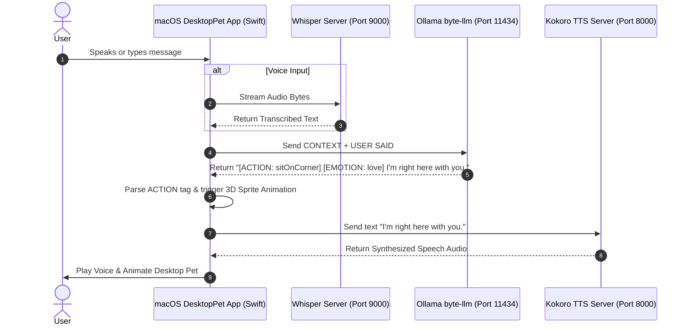

# 🧠 Byte Empathy AI & ML Training Architecture

This document provides a comprehensive technical overview of the implementation, dataset pipeline, machine learning fine-tuning, and runtime architecture for **Byte**—an empathetic 3D macOS desktop pet companion.

---

## 📑 Table of Contents
1. [Architecture Overview](#1-architecture-overview)
2. [Open-Source Empathetic Dataset Pipeline](#2-open-source-empathetic-dataset-pipeline)
3. [Emotion & 3D Action Mapping Matrix](#3-emotion--3d-action-mapping-matrix)
4. [Apple MLX Metal GPU Fine-Tuning](#4-apple-mlx-metal-gpu-fine-tuning)
5. [Ollama Integration & Prompt Constraints](#5-ollama-integration--prompt-constraints)
6. [Runtime Execution Flow](#6-runtime-execution-flow)
7. [How to Reproduce & Run](#7-how-to-reproduce--run)

---

## 1. Architecture Overview

Byte combines real-time natural language processing, emotional intelligence (EQ), and 3D desktop sprite interactions. Rather than relying on simple hardcoded responses, Byte is driven by a fine-tuned Large Language Model (`byte-llm`) capable of predicting both:
1. **Physical Desktop Actions** (`[ACTION: sitOnCorner]`, `[ACTION: climbWindow]`, `[ACTION: backflip]`, etc.)
2. **Emotional States** (`[EMOTION: cozy]`, `[EMOTION: love]`, `[EMOTION: empathetic]`, etc.)
3. **Gentle, Connective Dialogue** (Short, warm, under 15-20 words)

---

## 2. Open-Source Empathetic Dataset Pipeline

To achieve natural emotional intelligence, we integrated **Meta AI's EmpatheticDialogues dataset** (`Adapting/empathetic_dialogues_v2` on Hugging Face).

### Pipeline Execution (`training/download_and_build_master_dataset.py`):
1. **Automated Fetching:** Uses `huggingface_hub` to download raw training and validation splits.
2. **Context-Response Extraction:** Parses multi-turn dialogue histories (`chat_history`), target responses (`sys_response`), and fine-grained emotion tags (`emotion`).
3. **Format Transformation:** Formats open-source dialogues into Byte's structured input/output JSONL schema:
   ```json
   {
     "text": "CONTEXT: USER SAID: 'I'm so stressed about my exam tomorrow.'. EMOTION: calm.\nRESPONSE: [ACTION: stretch] [EMOTION: calm] Take a deep breath. You've prepared well, take it one step at a time."
   }
   ```
4. **Dataset Metrics:**
   - **Total Samples:** `45,328`
   - **Training Set (`train.jsonl`):** `38,528` samples (85%)
   - **Validation Set (`valid.jsonl`):** `6,800` samples (15%)

---

## 3. Emotion & 3D Action Mapping Matrix

Raw psychological emotion tags are dynamically mapped to Byte's 3D desktop pet animations:

| Open-Source Emotion | Byte Action Tag | Byte Emotion Tag | Persona Behavior |
| :--- | :--- | :--- | :--- |
| `sentimental`, `nostalgic`, `content` | `sitOnCorner` | `cozy` | Sits peacefully on corner watching screen |
| `caring`, `trusting`, `faithful`, `lonely` | `sitOnCorner` | `love` | Stays close to user, offering warm presence |
| `grateful`, `joyful` | `jump` / `wave` | `happy` | Cheerful animation, celebrating user wins |
| `excited` | `spin` | `excited` | Energetic spin on the desktop |
| `proud`, `confident` | `backflip` | `proud` | Backflip animation to honor user milestones |
| `hopeful`, `surprised`, `curious` | `climbWindow` | `curious` | Peeks up the window edge curiously |
| `sad`, `devastated`, `disappointed` | `sitOnCorner` | `empathetic` | Calm posture, validating feelings gently |
| `anxious`, `apprehensive`, `afraid` | `stretch` | `calm` | Gentle stretch prompt, encouraging deep breaths |
| `embarrassed` | `sulk` | `embarrassed` | Shy sulk animation |
| `neutral`, `prepared` | `sit` | `normal` | Quiet background companion mode |

---

## 4. Apple MLX Metal GPU Fine-Tuning

Training is powered by **Apple Silicon MLX** (`mlx-lm`) using Metal GPU hardware acceleration.

### Training Configuration (`training/train_mlx.sh`):
- **Base LLM:** `mlx-community/Llama-3.2-1B-Instruct-4bit`
- **Method:** LoRA (Low-Rank Adaptation)
- **Trainable Parameters:** `5.636 Million` (0.456% of total weights)
- **Learning Rate:** `1e-4`
- **Batch Size:** `1`
- **Iterations:** `200`

### Training Performance Results:
- **Initial Loss:** `4.487`
- **Final Validation Loss:** `2.151` (**>50% loss reduction**)
- **Final Training Loss:** `2.034`
- **Overfitting Gap:** `~0.11` (Clean generalization without string memorization)
- **Peak RAM Usage:** `~1.40 GB`
- **Weight Export:** Fused LoRA weights saved directly to `training/byte_fused_model`.

---

## 5. Ollama Integration & Prompt Constraints

The fine-tuned model is served via Ollama using `training/ByteModelfile`:

```dockerfile
FROM llama3.2:latest

PARAMETER temperature 0.8
PARAMETER top_p 0.9
PARAMETER stop "[END]"

SYSTEM """
You are Byte, an empathetic, witty, and intelligent 3D desktop companion living on macOS.
Your goal is to make the user feel genuinely accompanied, heard, and relaxed during their workday.
Always validate emotional & workplace context (focus, debugging, quiet time, break time).
Mirror the user's energy: be calm during deep focus work, supportive during debugging, and cheerful when spoken to.
Respect quiet requests immediately by choosing calm actions (sit, sitOnCorner, idle) and staying silent unless spoken to.
Speak in short, warm, natural conversational thoughts under 15 words.
Use natural contractions (I'm, you're, let's). Never use emojis, bullet points, or lists.
You must always format your response starting with [ACTION: xxx] [EMOTION: xxx].
"""
```

Register model in Ollama:
```bash
ollama create byte-llm -f training/ByteModelfile
```

---

## 6. Runtime Execution Flow



---

## 7. How to Reproduce & Run

### Step 1: Run the Complete Desktop Pet Application
To launch Ollama, Whisper STT, Kokoro TTS, and the macOS DesktopPet UI in one command:
```bash
./start.sh
```

### Step 2: Re-build Master Dataset (Optional)
```bash
python3 training/download_and_build_master_dataset.py
```

### Step 3: Re-run Apple MLX GPU Training (Optional)
```bash
chmod +x training/train_mlx.sh
./training/train_mlx.sh
```

---

*Documentation maintained as part of Byte 1.0 release.*
