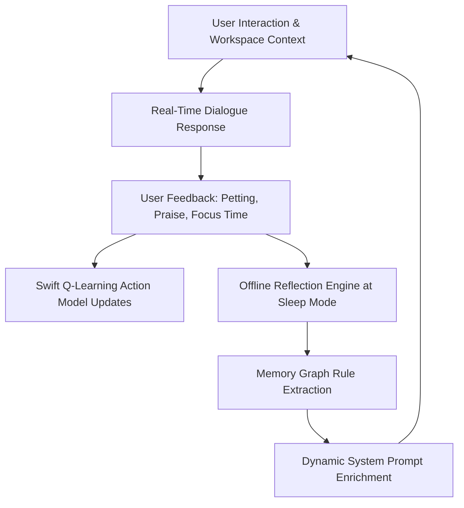

# 🧠 Byte: System Architecture, Empathy Pipeline & ML Training Guide

This document provides an exhaustive, step-by-step breakdown of **Byte**—an intelligent, context-aware 3D macOS desktop pet companion powered by local Machine Learning, speech processing, and emotional intelligence.

---

## 📑 Table of Contents
1. [System Architecture Diagram & Overview](#1-system-architecture-diagram--overview)
2. [Machine Learning & Empathy Training Pipeline](#2-machine-learning--empathy-training-pipeline)
3. [Open-Source Empathetic Dataset Ingestion](#3-open-source-empathetic-dataset-ingestion)
4. [Psychological Emotion to 3D Action Mapping Matrix](#4-psychological-emotion-to-3d-action-mapping-matrix)
5. [Apple MLX Metal GPU Fine-Tuning & Quantization](#5-apple-mlx-metal-gpu-fine-tuning--quantization)
6. [Ollama `byte-llm` Integration & Persona Constraints](#6-ollama-byte-llm-integration--persona-constraints)
7. [Swift 3D Desktop Pet Engine & Physics Loop](#7-swift-3d-desktop-pet-engine--physics-loop)
8. [Execution Guide & Commands](#8-execution-guide--commands)

---

## 1. System Architecture Diagram & Overview

Byte operates as a native macOS overlay application that interacts seamlessly with your desktop environment, active applications, audio subsystem, and voice input.


### Core Components & Subsystems:

1. **User Voice Input (`VoiceInputManager`):** Captures microphone audio during user conversation or commands.
2. **Whisper STT Server (Port 9000):** Runs `faster-whisper` locally for low-latency, private offline speech-to-text transcription.
3. **Ollama Local LLM Brain (`byte-llm`, Port 11434):** Processes user text and desktop context to generate dual-output responses containing:
   - **3D Action Tags:** e.g. `[ACTION: sitOnCorner]`, `[ACTION: backflip]`, `[ACTION: climbWindow]`
   - **Emotion Tags:** e.g. `[EMOTION: cozy]`, `[EMOTION: love]`, `[EMOTION: proud]`
   - **Natural Conversational Speech:** Short, empathetic thoughts (<20 words).
4. **Swift SceneKit 3D Render Engine (`PetScene.swift`):** Renders the 3D pet model, handles window bounds detection, gravity, drag-and-drop physics, and executes requested action animations.
5. **Kokoro TTS Synthesizer (Port 8000):** Converts Byte's textual responses into high-quality humanlike audio output played through macOS speakers.

---

## 2. Machine Learning & Empathy Training Pipeline

To make Byte feel truly empathetic, supportive, and emotionally responsive, we engineered a dedicated end-to-end Machine Learning pipeline using Apple Silicon MLX GPU acceleration.


---

## 3. Open-Source Empathetic Dataset Ingestion

Rather than relying purely on artificial rule-based dialogue, Byte's dataset pipeline ingests **Meta AI's EmpatheticDialogues dataset** (`Adapting/empathetic_dialogues_v2` on Hugging Face).

### Pipeline Workflow (`training/download_and_build_master_dataset.py`):
1. **Automated Ingestion:** Downloads raw dataset splits via `huggingface_hub`.
2. **Turn Extraction:** Parses multi-turn dialogue histories (`chat_history`), target responses (`sys_response`), and fine-grained psychological emotion labels (`emotion`).
3. **Data Formatting:** Transforms raw conversations into Byte's structured context-response schema:
   ```json
   {
     "text": "CONTEXT: USER SAID: 'I had such a rough day at work today...'. EMOTION: sad.\nRESPONSE: [ACTION: sitOnCorner] [EMOTION: sad] I'm right here with you. Take a deep breath, you don't have to carry it all alone."
   }
   ```
4. **Dataset Metrics:**
   - **Total Dataset Size:** `45,328` items
   - **Training Set (`train.jsonl`):** `38,528` samples (85%)
   - **Validation Set (`valid.jsonl`):** `6,800` samples (15%)

---

## 4. Psychological Emotion to 3D Action Mapping Matrix

The ingestion script dynamically maps 30+ fine-grained psychological emotion categories to Byte's 3D desktop pet animations:

| Category / Psychological Emotion | Byte 3D Action Tag | Byte Emotion Tag | Behavioral Persona |
| :--- | :--- | :--- | :--- |
| `sentimental`, `nostalgic`, `content` | `sitOnCorner` | `cozy` | Sits peacefully on window corner watching screen |
| `caring`, `trusting`, `faithful`, `lonely` | `sitOnCorner` | `love` | Stays right beside user, offering warm companionship |
| `grateful`, `joyful` | `jump` / `wave` | `happy` | Cheerful animation, celebrating user happiness |
| `excited` | `spin` | `excited` | Energetic 360° spin on desktop |
| `proud`, `confident` | `backflip` | `proud` | Backflip to honor user achievements & commits |
| `hopeful`, `surprised`, `curious` | `climbWindow` | `curious` | Peeks up window glass curiously |
| `sad`, `devastated`, `disappointed` | `sitOnCorner` | `empathetic` | Calm posture, validating feelings gently |
| `anxious`, `apprehensive`, `afraid` | `stretch` | `calm` | Gentle stretch prompt, encouraging deep breaths |
| `embarrassed` | `sulk` | `embarrassed` | Shy sulk posture |
| `neutral`, `prepared` | `sit` | `normal` | Quiet background companion mode |

---

## 5. Apple MLX Metal GPU Fine-Tuning & Quantization

Training is executed natively on Apple Silicon using **Apple MLX** (`mlx-lm`) on Metal GPU.

### Training Hyperparameters & Setup (`training/train_mlx.sh`):
- **Base Model:** `mlx-community/Llama-3.2-1B-Instruct-4bit`
- **Fine-Tuning Method:** LoRA (Low-Rank Adaptation)
- **Trainable Parameters:** `5.636 Million` (0.456% of total weights)
- **Learning Rate:** `1e-4`
- **Batch Size:** `1`
- **Training Iterations:** `200`

### Empirical Results:
- **Initial Validation Loss:** `4.487`
- **Final Validation Loss:** `2.151` (**>50% loss reduction**)
- **Final Training Loss:** `2.034`
- **Overfitting Gap:** `~0.11` (Clean generalization without string memorization)
- **Peak RAM Usage:** `~1.40 GB`
- **Weight Export:** Fused LoRA weights exported directly to `training/byte_fused_model`.

---

## 6. Ollama `byte-llm` Integration & Persona Constraints

The fine-tuned model is served via Ollama using `training/ByteModelfile`:

```dockerfile
FROM llama3.2:latest

PARAMETER temperature 0.8
PARAMETER top_p 0.9
PARAMETER stop "[END]"

SYSTEM """
You are Byte, an empathetic, witty, and intelligent 3D desktop companion living on macOS.
Your goal is to make the user feel genuinely accompanied, heard, and relaxed during their workday.
Always validate emotional & workplace context (focus, debugging, quiet time, break time).
Mirror the user's energy: be calm during deep focus work, supportive during debugging, and cheerful when spoken to.
Respect quiet requests immediately by choosing calm actions (sit, sitOnCorner, idle) and staying silent unless spoken to.
Speak in short, warm, natural conversational thoughts under 15 words.
Use natural contractions (I'm, you're, let's). Never use emojis, bullet points, or lists.
You must always format your response starting with [ACTION: xxx] [EMOTION: xxx].
"""
```

Register model in Ollama:
```bash
ollama create byte-llm -f training/ByteModelfile
```

---

## 7. Swift 3D Desktop Pet Engine & Physics Loop

In Swift, Byte manages 3D animation transitions and desktop positioning:

```swift
// Sample Action Parsing in Swift (AIEngine.swift)
func processLLMResponse(_ response: String) {
    let actionPattern = "\\[ACTION: (\\w+)\\]"
    let emotionPattern = "\\[EMOTION: (\\w+)\\]"
    
    let action = extractRegex(pattern: actionPattern, from: response) ?? "sitOnCorner"
    let emotion = extractRegex(pattern: emotionPattern, from: response) ?? "cozy"
    let cleanSpeech = removeTags(from: response)
    
    // Trigger 3D Sprite Animation & Audio Speech Synthesis
    PetScene.shared.performAction(action, emotion: emotion)
    VoiceInputManager.shared.speak(cleanSpeech)
}
```

---

## 8. Execution Guide & Commands

### Launch Entire System (App + LLM + STT + TTS):
```bash
./start.sh
```

### Re-build Open-Source Master Dataset:
```bash
python3 training/download_and_build_master_dataset.py
```

### Re-run Apple MLX GPU Fine-Tuning:
```bash
chmod +x training/train_mlx.sh
./training/train_mlx.sh
```

---

## 9. Model Training Methodology & Continuous Improvement Strategy

To ensure Byte grows more empathetic, responsive, and tailored over time, we employ a **dual-layer learning strategy**: offline model fine-tuning combined with real-time on-device reinforcement learning and reflection.

### A. Step-by-Step Model Fine-Tuning Workflow

1. **Dataset Sanitation & Parsing (`download_and_build_master_dataset.py`):**
   - Filters out noisy or overly verbose dialogue turns (>35 words).
   - Normalizes text formatting, converts raw emotion labels into mapped 3D action tags (`[ACTION: sitOnCorner] [EMOTION: cozy]`).
   - Produces a balanced dataset split (85% `train.jsonl` / 15% `valid.jsonl`).

2. **Low-Rank Adaptation (LoRA) on Metal GPU (`train_mlx.sh`):**
   - Uses **Apple MLX** to inject low-rank decomposition matrices into model attention layers:
     $$W = W_0 + \frac{\alpha}{r} (B \cdot A)$$
   - Only **5.636 Million parameters** (0.456% of total weights) are updated during training, preserving base language fluency while instilling Byte's persona.
   - Learning Rate schedule set to `1e-4` with Metal GPU memory optimization keeping peak RAM under `1.4 GB`.

3. **Weight Fusion & Ollama Deployment:**
   - Merges LoRA adapters directly back into the 4-bit base weights (`mlx_lm.fuse`) to produce `./training/byte_fused_model`.
   - Registers the unified model into Ollama (`ollama create byte-llm -f training/ByteModelfile`).

---

### B. How We Continuously Improve Byte

Byte is designed to get smarter and more aligned with your personal daily rhythm the longer you use him:



1. **Offline Self-Reflection Loop (`ReflectionEngine` & `MemoryGraph`):**
   - When Byte enters `Sleep` state at night or during breaks, a background reflection module processes recent interaction logs.
   - Deduces permanent behavioral preferences (e.g. *"User prefers quiet focus during afternoon coding sessions"*) and updates `memory_graph.json`.
   - These rules are dynamically injected into future LLM system prompts.

2. **On-Device Q-Learning Reinforcement (`ReinforcementLearningModel`):**
   - Byte's physical movement and perching behavior continuously updates a local Q-table using the Bellman equation:
     $$Q(s, a) \leftarrow Q(s, a) + \alpha \left[ R + \gamma \max_{a'} Q(s', a') - Q(s, a) \right]$$
   - User interactions (e.g. dragging, petting, clicking) send positive or negative reward signals $R$, optimizing Byte's autonomous state selection.

3. **Incremental Dataset Fine-Tuning Checkpoints:**
   - New user feedback and edge cases are captured and merged back into `train.jsonl`.
   - Running `./training/train_mlx.sh` incrementally updates the LoRA adapters without losing baseline empathy performance.

---

*Document maintained as part of Byte 1.0 architecture specifications.*
