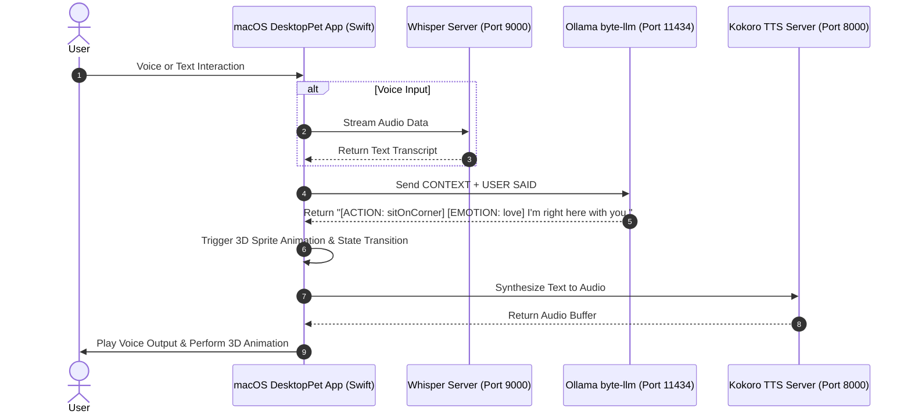

# System Architecture & Subsystems

Byte is built on a four-layer hybrid Machine Learning architecture operating natively and 100% offline on macOS.

## Core Subsystems Breakdown

### 1. User Voice Input & Speech-to-Text (`VoiceInputManager`)
- **Speech Recognition:** Integrates `faster-whisper` running locally on port `9000`.
- **Low Latency:** Processes continuous streaming audio from macOS microphone with offline privacy.

### 2. Ollama Local LLM Brain (`byte-llm`)
- **Endpoint:** Ollama service listening on port `11434`.
- **Model:** Fine-tuned `byte-llm` (based on `Llama-3.2-1B-Instruct-4bit`).
- **Structured Prediction:** Predicts dual-tag outputs:
  - `[ACTION: sitOnCorner]`
  - `[EMOTION: cozy]`
  - Short natural dialogue (under 20 words).

### 3. Swift SceneKit 3D Render & Physics Loop (`PetScene.swift`)
- **Rendering:** SceneKit 3D transparent desktop overlay.
- **Surface Physics:** Custom surface collision detection for window top frames, menu bars, and macOS Dock floor.
- **Interactive Throwing:** Free-form drag and toss physics with drag coefficient and gravity vector calculations.

### 4. Kokoro Text-to-Speech Synthesizer (`tts_server.py`)
- **Endpoint:** Kokoro TTS HTTP server listening on port `8000`.
- **Audio Output:** Converts text into humanlike voice synthesis streamed directly to macOS speakers.

