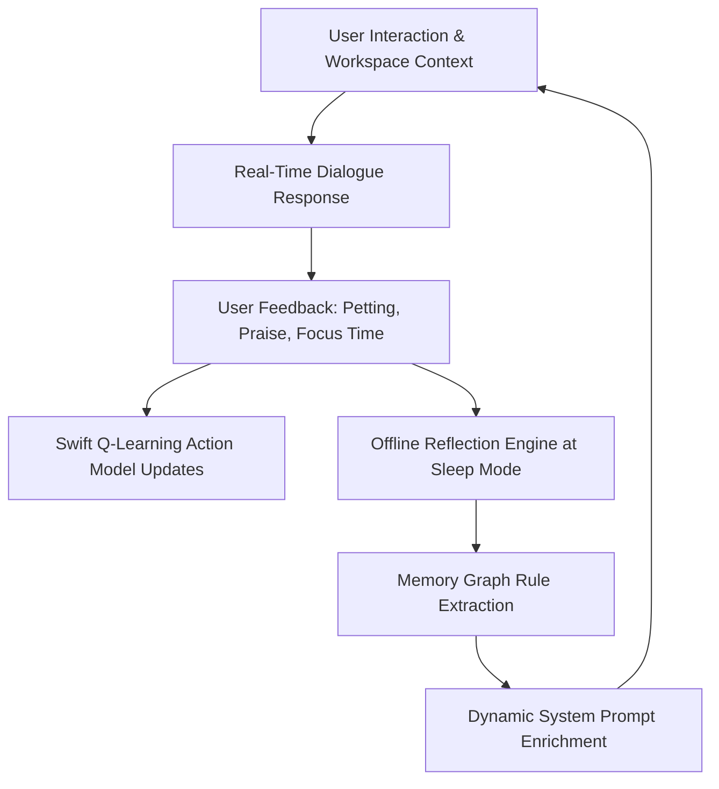

# Empathy AI & ML Fine-Tuning Pipeline

Byte's emotional intelligence is driven by a dedicated Machine Learning pipeline designed for Apple Silicon GPUs and Ollama deployment.


## 1. Open-Source Dataset Ingestion

Byte ingests Meta AI's **EmpatheticDialogues dataset** (`Adapting/empathetic_dialogues_v2` on Hugging Face).

### Pipeline Steps (`training/download_and_build_master_dataset.py`):
1. **Fetching:** Downloads raw CSV splits via `huggingface_hub`.
2. **Parsing:** Extracts multi-turn dialogue histories (`chat_history`), target responses (`sys_response`), and fine-grained emotion labels (`emotion`).
3. **Structuring:** Formats entries into Byte's schema:
   ```json
   {
     "text": "CONTEXT: USER SAID: 'I had such a rough day at work today...'. EMOTION: sad.\nRESPONSE: [ACTION: sitOnCorner] [EMOTION: sad] I'm right here with you. Take a deep breath, you don't have to carry it all alone."
   }
   ```
4. **Dataset Metrics:**
   - Total dataset: **45,328 samples**
   - Training split (`train.jsonl`): **38,528 samples**
   - Validation split (`valid.jsonl`): **6,800 samples**

---

## 2. Emotion to 3D Action Tag Mapping Matrix

Raw psychological emotion tags are mapped directly into Byte's 3D sprite animations:

| Category / Psychological Emotion | Byte 3D Action Tag | Byte Emotion Tag | Behavioral Persona |
| :--- | :--- | :--- | :--- |
| `sentimental`, `nostalgic`, `content` | `sitOnCorner` | `cozy` | Sits peacefully on window corner watching screen |
| `caring`, `trusting`, `faithful`, `lonely` | `sitOnCorner` | `love` | Stays right beside user, offering warm companionship |
| `grateful`, `joyful` | `jump` / `wave` | `happy` | Cheerful animation, celebrating user happiness |
| `excited` | `spin` | `excited` | Energetic 360° spin on desktop |
| `proud`, `confident` | `backflip` | `proud` | Backflip to honor user achievements & commits |
| `hopeful`, `surprised`, `curious` | `climbWindow` | `curious` | Peeks up window glass curiously |
| `sad`, `devastated`, `disappointed` | `sitOnCorner` | `empathetic` | Calm posture, validating feelings gently |
| `anxious`, `apprehensive`, `afraid` | `stretch` | `calm` | Gentle stretch prompt, encouraging deep breaths |
| `embarrassed` | `sulk` | `embarrassed` | Shy sulk posture |
| `neutral`, `prepared` | `sit` | `normal` | Quiet background companion mode |

---

## 3. Apple MLX Metal GPU Fine-Tuning

Training is executed natively on Apple Silicon using **Apple MLX** (`mlx-lm`).

### Training Parameters (`training/train_mlx.sh`):
- **Base Model:** `mlx-community/Llama-3.2-1B-Instruct-4bit`
- **Method:** LoRA (Low-Rank Adaptation)
- **Trainable Parameters:** `5.636 Million` (0.456% of total weights)
- **Learning Rate:** `1e-4`
- **Iterations:** `200`

### Performance Metrics:
- **Initial Validation Loss:** `4.487`
- **Final Validation Loss:** `2.151` (**>50% loss drop**)
- **Final Training Loss:** `2.034`
- **Peak Memory Usage:** `~1.40 GB RAM`
- **Model Export:** LoRA weights fused into `./training/byte_fused_model`.

---

## 4. Continuous Self-Learning Loop

Byte continuously improves through on-device reinforcement learning and sleep reflection:



- **Reflection Engine (`ReflectionEngine`):** During sleep state, evaluates past chat history to extract permanent rules saved into `memory_graph.json`.
- **Reinforcement Learning (`ReinforcementLearningModel`):** Movement decisions update a native Swift Q-table based on user reward/penalty interactions.
